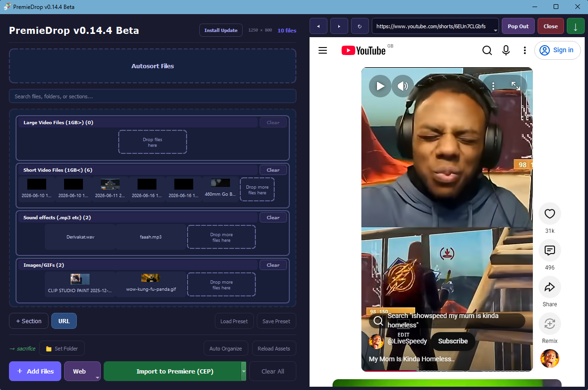

# PremieDrop

PremieDrop is a Windows desktop media library and editor workflow companion for
video creators. It helps collect clips, sounds, images, and web-downloaded media
into organized sections, preview them quickly, and send them into editing
software with less folder-hunting.

## App Showcase

[Watch the app showcase on YouTube](https://www.youtube.com/watch?v=nh3XjApA5Fg)



## Install

Download the latest stable installer from GitHub Releases:

https://github.com/Lotanami/PremieDropRepo/releases/latest

Or test the current beta:

[](https://github.com/Lotanami/PremieDropRepo/releases/download/v0.14.4-beta/PremieDropInstaller-v0.14.4-beta.exe)
[](https://github.com/Lotanami/PremieDropRepo/releases/tag/v0.14.4-beta)

The bundled installer includes the PremieDrop desktop app, Python runtime, app
packages, ffmpeg support through `imageio-ffmpeg`, and the Premiere Pro CEP
extension payload. VLC Media Player is still required separately for video
preview playback.

## Future Goals

- [ ] Final Cut Pro integration
- [ ] DaVinci Resolve free integration
- [ ] Premiere Pro UXP compatibility
- [ ] macOS compatibility
- [ ] Fix bugs from video (One of them is alr fixed)
- [ ] Restructure the code so that ppl don't wanna rip their eyes out
- [ ] Tidy up the Web feature interface (currently it's very messy cuz i tried to add in Giphy and Tenor)

## Main Capabilities

- Organize local media into named sections such as large video files, small
  video files, photos, sound effects, and audio.
- Add files manually or rescan a selected project folder into section folders.
- Save and load library presets for repeat project structures.
- Auto-organize loose media in a project folder into preset section folders.
- Search across files, folders, and sections.
- Drag selected files directly from PremieDrop into supported editors.
- Reveal files in File Explorer, remove individual items, clear sections, and
  rename or remove custom sections.
- Remember the selected project folder between sessions.
- Check for and run the latest installer from inside the app with the
  `Install Update` button.

## Preview Tools

- Image preview with aspect-ratio-preserving display.
- Audio preview in a compact embedded player.
- Standalone video preview windows powered by VLC.
- Play, pause, restart, fullscreen, volume, +/-5 second skip, direct timeline
  click seeking, and drag seeking.
- Center play/pause/restart overlays similar to a regular video player.
- Live timestamp feedback while dragging the video timeline.
- Duplicate prevention so opening the same video twice brings the existing
  preview forward instead of creating another copy.

## Web And Downloads

- Embedded/persistent media browser with quick entries for YouTube, MyInstants,
  Tenor, website search, and image search.
- Browser URL dropdown for opening presets and switching search targets.
- Direct search actions for YouTube, MyInstants, Tenor GIFs, and Giphy GIFs.
- Save and remove browser presets.
- Download media from direct URLs and browser-selected URLs.
- Remember the last accepted download folder.
- Clear browser cache on startup while preserving saved browser presets.
- Return from temporary website/image searches to the last default website the
  user had open.

## Editor Integrations

### Premiere Pro

- Bundled CEP extension: `PremieDrop Bridge V0`.
- Installer option for installing the Premiere Pro CEP extension.
- CEP bridge imports queued PremieDrop files into Premiere bins that match
  PremieDrop section names.
- Files already present in the Premiere project are skipped during automatic
  imports.
- CEP debug mode is enabled by the extension installer for supported CSXS
  versions.

### DaVinci Resolve

- DaVinci Resolve Studio import path is wired through Resolve's scripting API.
- Free Resolve automatic importing is marked unavailable because scripting
  support is limited.

### Future Providers

- Premiere Pro UXP is shown as a disabled installer/app option until the UXP
  package exists.
- Final Cut Pro is represented as an extension point but is not implemented yet.
- New import providers can be added under `systems/import_providers/`.

## Repository Layout

| Path | Purpose |
|---|---|
| `cep-extension/` | Premiere Pro CEP bridge package. |
| `systems/main.py` | Main PremieDrop desktop app. |
| `systems/PremieDropInstaller.py` | Bundled Windows installer UI and install logic. |
| `systems/premiedrop_ext/` | Import provider and UI extension registry. |
| `systems/import_providers/` | Built-in and future editor import providers. |
| `systems/build-windows.ps1` | Builds `premiedrop.exe`. |
| `systems/build-installer.ps1` | Builds `PremieDropInstaller-v*.exe`. |
| `systems/INSTALLER.md` | Installer build and release notes. |

## Build

Build the app executable:

```powershell
cd systems
.\build-windows.ps1
```

Build the installer executable:

```powershell
cd systems
.\build-installer.ps1
```

Run `build-windows.ps1` before `build-installer.ps1` so the installer bundles
the current `premiedrop.exe`. If no bundled app payload exists, the installer can
fall back to downloading the latest release asset.

## Notes For Contributors

- Read [CONTRIBUTING.md](CONTRIBUTING.md) for setup steps, project structure,
  and pull request guidance.
- Read [SUPPORT.md](SUPPORT.md) for bug report and support guidance.
- Read [SECURITY.md](SECURITY.md) before reporting security-sensitive issues.
- Read [CODE_OF_CONDUCT.md](CODE_OF_CONDUCT.md) for community expectations.
- Keep large generated executables out of normal source commits; publish them as
  GitHub Release assets.
- UI text, sizes, and theme values live in
  `systems/premiedrop_ext/ui_config.py`.
- Import integrations should register an `ImportProvider` instead of hardcoding
  editor-specific behavior into the main window.
- Optional UI additions can register through `UIExtensionRegistry`.
